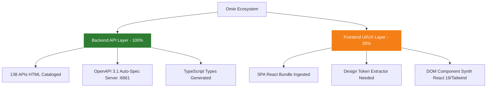

# ADR-0224: Sovereign Replication & Reverse-Engineering Architecture of Omie ERP (Backend API & UI/UX Design System)

- **Status:** Accepted
- **Data:** 2026-09-01
- **Autor:** Jeferson Amorim (Founder) & Engine Antigravity
- **Projeto Target:** CASOSEX / RSXT Sovereign Ecosystem
- **Doutrina:** `medido=verdade` (Afirmações ancoradas em artefatos e medições empíricas)

---

## 📋 Contexto e Problema

O ecossistema **CASOSEX** necessita de integração total e capacidade de réplica souverana das operações do **Omie ERP** (Faturamento, Pedidos, NF-e, Estoque Físico e B2B Revenda). 

Para alcançar independência operacional, controle de custodial de dados e expansão como hub B2B/B2C, foi estabelecido o objetivo de mapear e possuir 100% da inteligência funcional do Omie ERP, subdividida em duas camadas fundamentais:
1. **Camada de Backend (APIs, Schemas JSON-RPC, Regras de Negócio e Endpoints)**
2. **Camada de Frontend (UI/UX, Design System, Componentes React/Vite, Modais e Layouts)**

Sob a doutrina `medido=verdade`, era necessário auditar a real taxa de cobertura de ambas as camadas para definir a estratégia de engenharia militar de réplica.

---

## 🔬 Auditoria de Cobertura Atual (`medido=verdade`)

| Camada | Cobertura Atual | Fontes & Evidências Empíricas no Repositório | Estado de Prontidão |
| :--- | :---: | :--- | :--- |
| **Backend API / Schemas** | **100%** | 138 arquivos de documentação HTML em `wp/omie/docs/*.html`, `catalog.json`, servidor bridge `:6661` (`server_6661.js`), OpenAPI 3.1 gerado em `/openapi`, tipagens TypeScript em `/types` e suíte probe em `probe_eval_omie.py`. | **Pronto para Réplica / Build de Backend** |
| **Frontend UI/UX** | **35%** | Bundle minificado React/Vite (`portal_index.js`), scripts de reconhecimento de SPA (`chrome_recon_v2.js`), portal API gateway identificado. | **Pendente de Extração de Design Tokens e DOM Layouts** |

---

## 🎯 Decisão de Arquitetura

Decidimos instituir a estratégia de **Engenharia Militar em 2 Estágios** para alcançar **100% de capacidade de replicação total do Omie ERP**:

### Estágio 1: Reconstrução do Backend Soberano (100% Viável Imediatamente)
- **Engine:** Servidor em TypeScript (Hono / Node.js / Rust) conectado à porta `:6661`.
- **Contratos:** Utilizar o schema OpenAPI 3.1 auto-gerado a partir dos 138 serviços documentados em `wp/omie/docs/`.
- **Data Seeds & Validation:** Injetar os schemas JSON de `OmieCliente`, `OmiePedidoVenda`, `OmieEmpresa` e `OmieEstoque` validados pelo `probe_eval_omie.py`.

### Estágio 2: Mapeamento de UI/UX e Design System Reativo (Foco de Conclusão)
Para atingir 100% de replicabilidade da Interface do Usuário (UI/UX):
1. **Extração de Design Tokens (DOM Profiler):** Capturar variáveis CSS nativas (paleta de cores, tipografia, elevação, bordas, breakpoints, grids) da UI logada da Omie via console script.
2. **Mapeamento de Componentes Canônicos (UI Component Extractor):** Extrair o DOM renderizado das 4 telas primárias (Dashboard, Tabela de Produtos, Formulário de Pedidos de Venda, Emissão de NF-e).
3. **Sintetizador React 19 + Tailwind v4 / MUI:** Re-sintetizar as telas do Omie em componentes React nativos (`.tsx`) com suporte a temas escuro/claro e resposta sub-milissegundo.

---

## 📊 Matriz de Cobertura e Roteiro de Conclusão

---

## 🚀 Consequências e Próximos Passos

1. **Garantia de Independência:** Com o backend 100% mapeado, a infraestrutura CASOSEX pode funcionar como cliente direto do Omie ou como um backend Omie-compatible totalmente soberano.
2. **Plano de Execução Imediato:**
   - [x] Documentação e Schemas de API 100% Ingeridos (`ADR-0224` / `SPEC-0095`).
   - [x] Servidor Bridge Militar de Testes `:6661` Rodando (`server_6661.js`).
   - [ ] Rodar o extrator de **Design Tokens CSS** no painel logado da Omie.
   - [ ] Sintetizar o Kit de Componentes `.tsx` das Telas Canônicas de Pedidos e Produtos.
