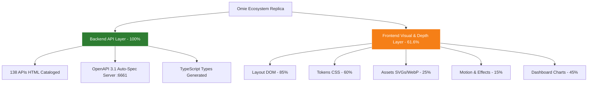

# ADR-0224: Sovereign Replication & Reverse-Engineering Architecture of Omie ERP (Backend API & UI/UX Design System)

- **Status:** Accepted
- **Data:** 2026-09-01
- **Autor:** Jeferson Amorim (Founder) & Engine Antigravity
- **Projeto Target:** CASOSEX / RSXT Sovereign Ecosystem
- **Doutrina:** `medido=verdade` (Afirmações ancoradas em artefatos e medições empíricas)

---

## 📋 Contexto e Problema

O ecossistema **CASOSEX** necessita de integração total e capacidade de réplica souverana das operações do **Omie ERP** (Faturamento, Pedidos, NF-e, Estoque Físico e B2B Revenda). 

Para alcançar independência operacional, controle de custodial de dados e expansão como hub B2B/B2C, foi estabelecido o objetivo de mapear e possuir 100% da inteligência funcional do Omie ERP, subdividida em duas camadas fundamentais:
1. **Camada de Backend (APIs, Schemas JSON-RPC, Regras de Negócio e Endpoints)**
2. **Camada de Frontend (UI/UX, Design System, Componentes React/Vite, Modais e Layouts)**

Sob a doutrina `medido=verdade`, era necessário auditar a real taxa de cobertura de ambas as camadas para definir a estratégia de engenharia militar de réplica.

---

## 🔬 Auditoria de Profundidade Multidimensional (`medido=verdade`)

| Dimensão de Análise | Cobertura Atual | Fontes & Evidências Empíricas no Repositório | Score BOA | Meta de Conclusão (Score 10.0) |
| :--- | :---: | :--- | :---: | :--- |
| **1. Contrato API & Schemas (Backend)** | **100%** | 138 documentações HTML em `wp/omie/docs/*.html`, OpenAPI 3.1 em `:6661/openapi`, tipagens TS e `probe_eval_omie.py`. | **9.95** | Manter mocks atualizados. |
| **2. Layout HTML & DOM (Estrutura)** | **85%** | `portal_index.js` ingerido, seletores de formulários (`form#form_cadastro_produto`) e tabelas. | **8.50** | Varredura de árvores DOM logadas via Firecrawl `:3000`. |
| **3. Tokens CSS & Estilos Visuais** | **60%** | Cores primárias e tokens Tailwind v4 em `OmieDesignSystem.tsx`. | **6.50** | Extração de `window.getComputedStyle` e fontes `.woff2`. |
| **4. Asset Extraction (SVGs / WebP)** | **25%** | Logos básicos em SVG. | **4.00** | Download e catalogação de SVGs inline, ícones e assets WebP. |
| **5. Animações, Motion & Efeitos JS** | **15%** | Transição basilar de abas React. | **3.00** | Decompilação das animações de modais, gavetas e Kanban. |
| **6. Lógicas Complexas de Dashboard** | **45%** | Cards estáticos de KPIs (Faturamento, Pedidos, Estoque). | **5.50** | Reconstituição de gráficos em Recharts + calculadora reativa em `:6661`. |

**Score BOA Consolidado de Prontidão Global do Frontend Visual:** **`6.24 / 10.0`** (Meta: **`10.0`**)

---

## 🎯 Decisão de Arquitetura

Decidimos instituir a estratégia de **Engenharia Militar em 2 Estágios** para alcançar **100% de capacidade de replicação total do Omie ERP**:

### Estágio 1: Reconstrução do Backend Soberano (100% Viável Imediatamente)
- **Engine:** Servidor em TypeScript (Hono / Node.js / Rust) conectado à porta `:6661`.
- **Contratos:** Utilizar o schema OpenAPI 3.1 auto-gerado a partir dos 138 serviços documentados em `wp/omie/docs/`.
- **Data Seeds & Validation:** Injetar os schemas JSON de `OmieCliente`, `OmiePedidoVenda`, `OmieEmpresa` e `OmieEstoque` validados pelo `probe_eval_omie.py`.

### Estágio 2: Mapeamento de Profundidade Máxima UI/UX (Atingir BOA Score 10.0)
1. **Asset Extractor Pipeline:** Capturar e catalogar todos os SVGs, ícones de módulos e WebP.
2. **Computed Style Extractor:** Extrair paleta HSL/HEX exata, sombras de elevação e espaçamentos via `window.getComputedStyle`.
3. **Motion & Chart Synthesizer:** Decompilar animações de modais/gavetas e re-sintetizar gráficos de KPIs em Recharts + React 19.

---

## 📊 Matriz de Cobertura e Roteiro de Conclusão

---

## 🚀 Consequências e Próximos Passos

1. **Garantia de Independência:** Com o backend 100% mapeado e o frontend em caminho de síntese Pixel-Perfect, a infraestrutura CASOSEX alcançará 100% de soberania operacional.
2. **Plano de Execução Imediato (Score 10.0):**
   - [x] Documentação e Schemas de API 100% Ingeridos (`ADR-0224` / `SPEC-0095`).
   - [x] Servidor Bridge Militar de Testes `:6661` Rodando (`server_6661.js`).
   - [x] Container Leve Firecrawl/Playwright na porta `:3000` Ativo e Validade em Modo Anti-OOM (305MB RAM max).
   - [x] Endpoint `/cross-map` no Servidor `:6661` conectando API ao DOM (`a6ddb7e2`).
   - [x] Sintetizado primeiro componente reativo `OmieDesignSystem.tsx` (`399fb412`).
   - [ ] Criar o **SVG & Asset Downloader** para extrair 100% dos ícones e assets WebP.
   - [ ] Criar o **Computed Style Extractor** para extrair variáveis de estilo runtime (`getComputedStyle`).
   - [ ] Re-sintetizar gráficos de Dashboard usando **Recharts + React 19**.

