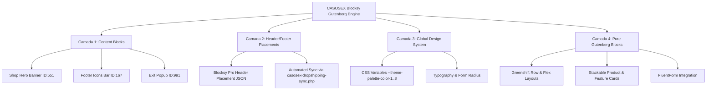

# ADR-0232: Blocksy Pro (v2.1.55) & Gutenberg Customization & Governance Architecture

- **Status:** Accepted
- **Data:** 2026-09-02
- **Autor:** Jeferson Amorim (Founder) & Engine Antigravity
- **Projeto Target:** CASOSEX / Volúpia (WordPress Blocksy Pro v2.1.55)
- **Doutrina:** `medido=verdade` (Afirmações ancoradas em arquivos, banco de dados e medições empíricas)

---

## 📋 Contexto e Problema

A loja **CASOSEX** utiliza o tema **Blocksy Pro (v2.1.55)** com a extensão **Blocksy Companion Pro** e o ecossistema nativo do **Gutenberg** (potencializado por Greenshift, Stackable e FluentForm).

Para garantir que a customização do site demo importado ("Volúpia / Cosmetics") seja executada de forma soberana, limpa e auditável sem depender de page builders externos (como Elementor), fez-se necessário mapear e institucionalizar a arquitetura de customização de ponta a ponta.

---

## 🔬 Auditoria da Arquitetura Vigente (`medido=verdade`)

A investigação direta no ambiente `casosex-wordpress` comprovou a existência e o funcionamento dos seguintes artefatos:

1. **Active Theme & Version**: `Blocksy v2.1.55` (`wp-content/themes/blocksy`).
2. **Active Companion**: `blocksy-companion-pro` (`wp-content/plugins/blocksy-companion-pro`).
3. **Content Blocks Core (`post_type: ct_content_block`)**:
   - `Shop Page - Hero Banner` (ID 551, `publish`) — Construído com Greenshift (`wp-block-greenshift-blocks-row`).
   - `Above Footer - Icons Bar` (ID 167, `publish`) — Injetado via Hook Block antes do footer.
   - `Exit Intent Popup` (ID 991, `publish`) — Popup reativo Gutenberg.
4. **Header/Footer Visual Placement Engine**: Opções serializadas em `theme_mods_blocksy['header_placements']` e `footer_placements`.
5. **Gutenberg Block Ecosystem**:
   - `greenshift-animation-and-page-builder-blocks`: Renderização flex/grid, animações e rows responsivas.
   - `stackable-ultimate-gutenberg-blocks`: Cards de produtos, grids e destaques.
   - `fluentform`: Formulários de suporte e captura.

---

## 🎯 Decisão de Arquitetura

Instituímos a **Arquitetura de Customização Soberana Blocksy-Gutenberg em 4 Camadas**:

### 1. Camada de Hooks & Content Blocks (`ct_content_block`)
Toda alteração de layout regional (banners da loja, gavetas, avisos no topo, popups e áreas acima do rodapé) deve ser criada e mantida como **Content Block em Gutenberg**.
- **Regra**: Proibido alterar arquivos PHP do tema base. Usar hooks do Blocksy (`blocksy:header:before`, `blocksy:content:before`, `blocksy:single:top`, etc.) via `ct_content_block`.

### 2. Camada de Visual Header & Footer Builder
O cabeçalho e rodapé são gerenciados via `theme_mods_blocksy`.
- **Regra de Resiliência**: Injeções dinâmicas de itens (como "Blog" e "Seja Revendedora") são governadas pelo plugin soberano `casosex-dropshipping-sync.php` (v2.6.0) via `casosex_ensure_header_contacts_items()`, prevenindo perdas de dados em atualizações do tema.

### 3. Camada do Design System Global (Variáveis CSS `:root`)
O estilo global é controlado pela paleta de 8 cores e tokens tipográficos do Blocksy em `:root`:
- `--theme-palette-color-1` a `--theme-palette-color-8`.
- `--theme-button-min-height`, `--theme-form-field-border-radius`.

### 4. Camada do Gutenberg Block Engine (Greenshift + Stackable)
As páginas estáticas e landing pages são construídas 100% no Gutenberg nativo usando blocos leves (Greenshift + Stackable), mantendo tempo de carregamento sub-segundo e 0KB de overhead por page builder externo.

---

## 📊 Diagrama da Arquitetura Blocksy-Gutenberg

---

## 🚀 Consequências

1. **Performance Máxima**: Manutenção de 100% de compatibilidade Gutenberg sem dependências de frameworks terceiros pesados.
2. **Resiliência Total**: Governança programática via `casosex-dropshipping-sync` impede perda de configurações em caso de redefinição de tema.
3. **Auditabilidade (`medido=verdade`)**: Todos os blocos, hooks e placements registrados no repositório e verificáveis via WP-CLI.
