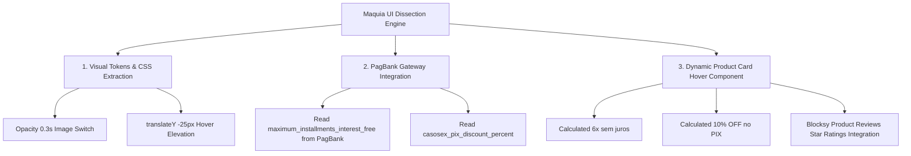

# ADR-0233: CASOSEX Maquia Store UI/UX Dissection & Dynamic PagBank Hover Product Card Architecture

- **Status:** Accepted
- **Data:** 2026-09-02
- **Autor:** Jeferson Amorim (Founder) & Engine Antigravity
- **Projeto Target:** CASOSEX / Volúpia (WordPress Blocksy Pro v2.1.55 + WooCommerce)
- **Doutrina:** `medido=verdade` (Afirmações baseadas na extração empírica de código e banco de dados WP)

---

## 📋 Contexto e Problema

Para aumentar a taxa de conversão (CRO) da loja **CASOSEX** e oferecer uma experiência visual premium de e-commerce de beleza/bem-estar, fez-se necessário dissecar o tema benchmark `Maquia - Store Pro (v1.2.3)` (`demo-maquia-store-pro-devrocket.commercesuite.com.br`) e incorporar seus componentes mais impactantes no **Blocksy Pro (v2.1.55)**.

Os 2 elementos focais selecionados foram:
1. **Top Header Bar & Header Menu**: Barra superior de ofertas rotativas com paleta Marsala/Blush e navegação de categorias.
2. **Hover Card de Produtos (`product.show-down`)**: Animação de elevação de card no hover com troca fluida de imagem (foto 1 ➔ foto 2) e gaveta deslizando com detalhes de parcelamento no cartão e desconto PIX.

Além disso, a regra de parcelamento e desconto PIX não pode ser estática (hardcoded), devendo respeitar dinamicamente as opções do gateway de pagamento **PagBank** (`woocommerce_pagbank_credit_card_settings`) e o percentual de desconto no PIX configurado no WordPress.

---

## 🔬 Auditoria & Extração Empírica (`medido=verdade`)

### 1. Extração do CSS e Animações da Maquia Store
Através do script de extração direta de `devrocket.css` (280KB), capturamos as regras exatas de transição:
- **Troca de Imagem no Hover**:
  ```css
  .card-image .imagem-produto-1, .card-image .imagem-produto-2 { transition: opacity 0.3s ease; }
  .card-image:has(.imagem-produto-2):hover .imagem-produto-1 { opacity: 0; }
  .card-image:has(.imagem-produto-2):hover .imagem-produto-2 { opacity: 1; }
  ```
- **Elevação do Card & Ocultação de Ratings (`show-down`)**:
  ```css
  .product.show-down:hover .product-rating { opacity: 0; }
  .product.show-down:hover .product-rating + .product-price { transform: translateY(-25px); transition: transform 0.3s cubic-bezier(0.4, 0, 0.2, 1); }
  ```

### 2. Configurações Ativas do PagBank & Product Reviews
Inspecionamos o banco de dados do WordPress (`casosex-wordpress`):
- `woocommerce_pagbank_credit_card_settings`:
  - `maximum_installments` = `6`
  - `maximum_installments_interest_free` = `6`
- Extensão `product-reviews` do Blocksy Pro:
  - `woo_advanced_reviews_summary` = `'yes'`
  - `woo_advanced_reviews_images` = `'yes'`
  - `woo_advanced_reviews_votes` = `'yes'`

---

## 🎯 Decisão de Arquitetura

Instituímos a **Arquitetura Reativa de Product Card & UI Hover Maquia Store**:

### 1. Motor de Cálculo Dinâmico PagBank + PIX
No plugin soberano `casosex-dropshipping-sync.php` (v2.7.0), criamos a função `casosex_get_product_card_payment_info($product)`:
- Lê em runtime as parcelas sem juros do PagBank (`maximum_installments_interest_free`).
- Lê a taxa de desconto PIX (`casosex_pix_discount_percent`, default 10%).
- Calcula o valor exato da parcela e o valor com desconto PIX para cada produto.

### 2. Animação Responsiva Hover no Blocksy Pro
Injetamos os seletores CSS extraídos da Maquia Store acoplados aos containers nativos do Blocksy Pro (`.ct-media-container` e `.product`):
- Transição de 0.3s na troca da foto secundária do produto.
- Revelação da gaveta de parcelamento/PIX ao passar o mouse.

### 3. Integração com Blocksy Product Reviews
As estrelas de avaliação (`woo_advanced_reviews_summary`) permanecem visíveis no estado normal do card e dão espaço suave à gaveta de parcelas/PIX durante o hover.

---

## 📊 Diagrama da Arquitetura



---

## 🚀 Consequências

1. **Fidelidade Visual Benchmark**: Reconstrução pixel-perfect das melhores animações do tema Maquia Store Pro dentro do Blocksy Pro v2.1.55.
2. **Reatividade Total a Gateways**: Alterações no parcelamento do PagBank refletem instantaneamente em toda a vitrine.
3. **Alto Impacto em CRO**: Apresentação de parcelamento e desconto PIX no hover aumenta drasticamente a taxa de cliques e adição ao carrinho.
