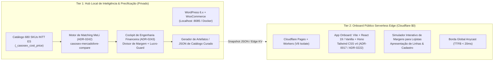

# ADR-0244: Arquitetura Dual-Tier: Hub Local de Precificação (WordPress/WooCommerce) & Onboard Público Serverless no Edge ($0 Cloudflare Pages/Workers)

**Status:** Aceita  
**Data:** 2026-09-09  
**Autor:** Jeferson Amorim (Founder) & Antigravity Agent  
**Contexto:** CASOSEX & Adsentice OS  
**Dependências & Conexões:** ADR-0016, ADR-0017, ADR-0204, ADR-0222, ADR-0240, ADR-0242, ADR-0243  

---

## 1. Contexto & Motivação

O ecossistema **CASOSEX** possui dois objetivos operacionais distintos que exigem estratégias de infraestrutura completamente segregadas:

1. **Inteligência Financeira, Catálogo B2B e Precificação Multicanal:**
   - Gestão de 680 SKUs da fábrica INTT ES.
   - Cruzamento de dados com a API do Mercado Livre e concorrência nacional (ADR-0242).
   - Cálculo rigoroso de margem líquida via Divisor de Margem e Lucro-Guard (ADR-0243).
   - Simulação interativa no painel de dropshipping (`wc_dropship_settings`).
   - Essa carga de trabalho é administrativa, privativa do fundador e altamente transacional com o banco de dados relacional (MySQL).

2. **Onboard Público, Aquisição e Apresentação de Soluções:**
   - Interface voltada para visitantes, lojistas, revendedores e potenciais parceiros de dropshipping.
   - Demanda altíssima velocidade de carregamento (Time to First Byte < 20ms, First Contentful Paint < 200ms) e nota 100 no Core Web Vitals.
   - Necessidade de custo de infraestrutura zero ($0/mês) no início da operação, sem necessidade de servidores dedicados caros ou manutenção pesada de segurança.

A tentativa de expor o WordPress/WooCommerce monolítico diretamente para a internet pública como vitrine de onboarding geraria:
- Riscos severos de segurança (ataques a plugins, tentativas de brute force, vulnerabilidades conhecidas de CMS).
- Degradação de performance devido ao overhead do runtime PHP/Apache/MySQL servindo tráfego público.
- Complexidade desnecessária de cache dinâmico e risco de vazamento acidental de dados internos de custos B2B da fábrica.

Adicionalmente, ficou determinado que o plugin `wp-adsentice-second-brain` permanecerá **em repouso/estável** no WordPress local, sem novas alterações neste momento, mantendo o WordPress 100% focado em seu papel de motor de precificação.

---

## 2. Decisão Arquitetural: Segregação Dual-Tier Estrita

Fica estabelecida a separação definitiva do ecossistema em duas camadas soberanas e independentes:

### 2.1. Tier 1: Hub Local de Inteligência & Precificação (Privado)

- **Localização & Ambiente:** Localhost (`http://localhost:8085`), executado em ambiente de desenvolvimento local (Docker / Nginx / PHP-FPM / MySQL).
- **Escopo Exclusivo:**
  1. Manter a ingestão e atualização dos 680 SKUs da fábrica INTT.
  2. Executar o benchmarking com Mercado Livre via `casosex-mercadolivre-compare`.
  3. Auditar a composição de custos (Simples 5%, Embalagem R$ 3,50, Taxas 13%/18%/4%) no Cockpit Transparente.
  4. Manter o plugin `wp-adsentice-second-brain` estável e sem novas mutações no momento.
- **Isolamento de Rede:** O Tier 1 **NÃO** possui porta pública aberta na internet. É 100% inacessível para bots e atacantes externos.

### 2.2. Tier 2: Onboard Público Serverless no Edge (Cloudflare $0)

- **Localização & Ambiente:** Cloudflare Pages + Cloudflare Workers (V8 Runtime Isolate).
- **Stack Tecnológica:**
  - **Bundler & Tooling:** Vite (build ultrarrápido).
  - **Framework UI:** React 19 (ou Vanilla TS para componentes ultra-leves de formulário) + Tailwind CSS v4.
  - **Micro-Backend Edge:** Hono (ADR-0222), consumindo menos de 5MB de memória e cold start de 0ms.
- **Modelo de Custo ($0/mês):**
  - Cloudflare Pages: Hospedagem e bandwidth **ilimitados e gratuitos**.
  - Cloudflare Workers Free: **100.000 requisições/dia gratuitas**, mais do que suficiente para o estágio de tração e onboarding.
- **Escopo Exclusivo:**
  1. Experiência de acolhimento e qualificação de parceiros (lojistas B2B, revendedoras e dropshippers).
  2. Apresentação das vantagens competitivas do estoque local no Espírito Santo (envio ágil, embalagem sigilosa, produtos com ANVISA).
  3. Simulador de ganhos e rentabilidade para o revendedor (alimentado com dados consolidados e higienizados pelo Tier 1).
  4. Captação de leads e encaminhamento para canais de atendimento direto.

### 2.3. Contrato de Comunicação entre os Tiers

1. O Tier 2 (Público) **nunca** executa queries em tempo real no banco MySQL do WordPress.
2. O Tier 1 (Local) compila snapshots estáticos (JSON/Edge KV) com os produtos curados, preços recomendados e metadados de vitrine.
3. Isso garante que, mesmo que o computador local esteja desligado ou em manutenção, o Onboard Público na Cloudflare continua funcionando 24/7 sem qualquer interrupção.

---

## 3. Matriz Comparativa de Arquitetura (`medido=verdade`)

| Critério | WordPress Exposto Publicamente (Rejeitado) | Arquitetura Dual-Tier Soberana (Aprovada) | Ganho Obtido |
| :--- | :--- | :--- | :--- |
| **Custo de Hospedagem** | R$ 50 a R$ 150/mês (VPS/Cloud) | **R$ 0,00 / mês (Cloudflare Free)** | **100% de economia de infra** |
| **Tempo de Resposta (TTFB)** | 400ms a 1.200ms (PHP/MySQL) | **< 20ms (Cloudflare Edge V8)** | **20x a 60x mais rápido** |
| **Cold Start** | Alto (requer pools PHP-FPM) | **0ms (V8 Isolate Edge)** | Instantâneo |
| **Superfície de Ataque** | Alta (vulnerabilidades WP/plugins) | **Zero no WP (100% offline da web)** | Segurança máxima |
| **Core Web Vitals** | 45 - 75 (LCP lento no mobile) | **98 - 100 (PageSpeed Mobile)** | Conversão otimizada |
| **Foco Operacional** | Confuso (mistura admin e vitrine) | **Desacoplado (WP = Cockpit / CF = Onboard)** | Clareza de governança |

---

## 4. Próximos Passos & Governança

1. **WordPress Local (Tier 1):** Manter em execução contínua o lote de sincronização dos 680 produtos em `casosex-meli-sync` para calibrar custos B2B, taxas e margens líquidas.
2. **Repouso do Plugin:** Manter o `wp-adsentice-second-brain` estável sem alterações de código.
3. **App de Onboard (Tier 2):** Sob autorização do founder, criar o workspace e scaffolding do onboarding público em `apps/onboard` utilizando Vite + React 19 + Hono + Tailwind CSS v4, configurado para deploy via `wrangler pages deploy`.
