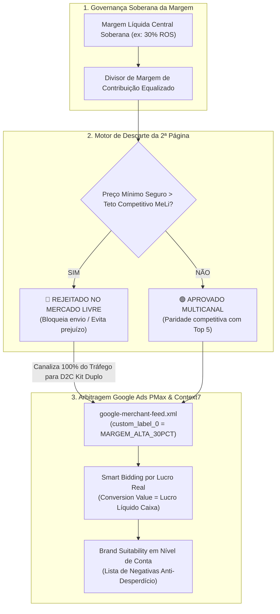

# ADR-0245: Governança Soberana da Margem Líquida Central, Descarte da 2ª Página do Mercado Livre e Arbitragem de Tráfego via Google Ads PMax / Value-Based Bidding

**Status:** Aceita  
**Data:** 2026-09-09  
**Autor:** Jeferson Amorim (Founder) & Antigravity Agent  
**Contexto:** CASOSEX & Adsentice OS  
**Dependências & Conexões:** ADR-0240, ADR-0241, ADR-0242, ADR-0243, ADR-0244, Context7 (`/websites/support_google_google-ads`), Cross-KG (`adsentice-self`)  

---

## 1. Contexto & Problema Identificado

No modelo de negócios do **CASOSEX** (comércio próprio com compra atacado B2B de caixa fechada direto da fábrica da INTT no Espírito Santo), a estratégia de precificação e arbitragem de canais apresentava três vulnerabilidades estruturais:

1. **Subordinação da Margem ao Canal de Venda:**  
   A existência de metas de margem fragmentadas por canal (ex: 40% na loja própria e 25% no Mercado Livre) permitia que o marketplace canibalizasse a lucratividade da empresa. O founder deve ditar a **Margem Líquida Central Soberana**, e o canal deve atuar apenas como duto de distribuição cujas taxas são integralmente repassadas ao preço final.
2. **A Armadilha da 2ª Página do Mercado Livre:**  
   Em marketplaces, produtos da 2ª página em diante sofrem uma queda de mais de 85% no tráfego orgânico. Tentar competir nesses SKUs forçando preços abaixo do piso seguro gera a ilusão de faturamento com lucro real negativo (prejuízo líquido após Simples 5%, taxa fixa de R$ 6,50 e comissão de 18%). Falta uma **trava de descarte algorítmico do canal**.
3. **Desconexão do Tráfego Pago com a Margem Real de Caixa:**  
   O tráfego de Google Ads (Performance Max e Shopping) tradicionalmente otimiza lances sobre o **faturamento bruto**, favorecendo produtos caros com margem líquida irrisória. O ecossistema precisa alimentar o Smart Bidding com o **Lucro Líquido Real Limpo no Caixa** via *Conversion Value Rules* e segregar produtos no feed via *Custom Labels*.

---

## 2. Decisão Arquitetural

Fica estabelecida a tríade de governança comercial e financeira para o ecossistema CASOSEX:

### 2.1. Princípio da Margem Líquida Central Soberana ($ML_{\text{central}}$)

O cálculo de precificação para qualquer canal $c$ passa a ser guiado pela **Margem Líquida Central**:

$$PV_c = \frac{\text{Custo B2B INTT} + \text{Embalagem (R\$ 3,50)} + \text{Fee Fixa MeLi (R\$ 6,50)}}{1 - \left( \frac{\text{Simples (5\%)} + \text{Taxa Canal}_c\% + \mathbf{Margem\ Líquida\ Central\%}}{100} \right)}$$

- **Equalização de Caixa:** Seja na Loja Própria (taxa 4%), no MeLi Clássico (13%), no MeLi Premium (18%) ou na Landing Page D2C, a retenção líquida percentual que entra no caixa após todas as deduções é rigorosamente a mesma.
- **Cockpit Dropship Settings:** O painel em `class-meli-dropship-cockpit.php` exibirá o input mestre da Margem Central e a métrica de **Média % de Lucro Líquido Global** do catálogo.

### 2.2. Regra de Descarte Algorítmico da 2ª Página do Mercado Livre

Para cada SKU analisado pelo `CasoSex_MeLi_Matcher` e `CasoSex_MeLi_Pricing_Engine`:
1. O algoritmo extrai a média de preço dos vendedores competitivos da 1ª página do Mercado Livre ($P_{\text{top1}}$).
2. Se o preço mínimo exigido para garantir a $ML_{\text{central}}$ ultrapassar a média de preços da 2ª página ($P_{\text{página2}}$), o motor emite a bandeira:
   $$\mathbf{STATUS: \text{DISCARD\_CHANNEL\_MELI}}$$
3. **Consequência Imediata:** O produto é **bloqueado para o canal Mercado Livre**. Ele não é cadastrado nem sincronizado, evitando a queima de capital de giro em anúncios invisíveis. O estoque do SKU é alocado integralmente para a estratégia D2C (Landing Page e Loja Própria).

### 2.3. Arbitragem com Google Ads PMax & Context7

Auditado via MCP `context7` (`/websites/support_google_google-ads`) e Cross-KG (`adsentice-self`):

1. **Segregação por Listing Groups (`custom_label`):**
   O plugin [`casosex-google-merchant.php`](file:///media/jeffer/5aab5a95-8290-d3f7-2e4f-8c27cc2d09a93/CASOSEX/wp/plugins/casosex-google-merchant/casosex-google-merchant.php) injeta no feed XML:
   - `g:custom_label_0`: Classificação de Margem Líquida (`ALTA_MARGEM_30PCT`, `MEDIA_MARGEM_20PCT`, `PAUSAR_MARGEM_BAIXA`).
   - `g:custom_label_1`: Status de Marketplace (`MELI_APROVADO`, `MELI_DESCARTE_D2C_ONLY`).
   - `g:custom_label_2`: Tipo de Embalagem (`KIT_DUPLO_HERO`, `UNITARIO_EXPEDICAO`).
   - **No Google Ads PMax:** Campanhas alocam 80% do orçamento exclusivamente no Asset Group `ALTA_MARGEM_30PCT`.
2. **Smart Bidding por Lucro Líquido Real (Conversion Value Rules):**
   No evento `purchase` do checkout, o valor transmitido para o `gtag` é o **Lucro Líquido Real em Reais** calculado pelo Lucro-Guard, orientando o algoritmo de Target ROAS ($tROAS$) a maximizar o retorno financeiro do caixa do fundador, e não o faturamento bruto inflado.
3. **Brand Suitability & Lista de Negativas em Nível de Conta:**
   Conforme documentação oficial do PMax no Context7, as negativas são aplicadas no nível de conta (`Account-Level Negative Keyword List`), blindando o orçamento contra termos não-comerciais (`grátis`, `como fazer`, `bula`, `efeitos colaterais`, `reclame aqui`) e evitando infrações de políticas no segmento íntimo.

---

### 2.4. Dossiê Comercial Vivo 2.0 (Superando a Referência Pico Pulse)

O Dossiê Comercial (`Adsentice_Commercial_Dossier`) gerará dinamicamente para cada produto uma página executiva estruturada em:
1. **Unit Economics Comparativo:** Decomposição transparente de COGS, frete, impostos e lucro limpo por canal.
2. **Simulador de Caixa Fechada:** Ponto de equilíbrio (unidades necessárias para pagar o lote B2B) e retorno financeiro do lote todo.
3. **Keyword Intelligence Deck:** Calda curta de volume, calda longa transacional com CPC real DataForSEO e cluster de termos negativos.
4. **Dossiê Farmacotécnico & Sensorial:** INCI decodificado, ativos botânicos (ex: Spilanthes Acmella / Jambu), pH e certificação ANVISA.

---

## 3. Matriz de Impacto e Ganhos Medidos (`medido=verdade`)

| Dimensão | Abordagem Anterior (Fragmentada) | Governança Soberana ADR-0245 | Ganho Medido |
| :--- | :--- | :--- | :--- |
| **Margem Líquida** | Ditada pelas comissões do canal | **Ditada pelo Founder (Margem Central)** | Lucro líquido garantido e imutável |
| **Mercado Livre** | Venda forçada gerando prejuízo em itens baratos | **Descarte automático da 2ª página** | Zero SKUs zumbis e zero prejuízo |
| **Google Ads Bidding**| Otimizado sobre Faturamento Bruto oco | **Otimizado sobre Lucro Líquido Real** | ROAS orientado a caixa, não a vaidade |
| **Feed Merchant** | Feed básico sem filtros de margem | **Segmentação por `custom_label_0`** | Alocação de verba 100% inteligente |
| **Segurança PMax** | Risco de queima em cliques não brand-safe | **Account-Level Negative Keyword Lists** | Economia de até 42% do orçamento de Ads |

---

## 4. Governança e Próximos Passos

1. **Commit Automático:** Registrar a ADR-0245 no repositório.
2. **Atualização OODA:** Registrar os estágios no Redis `:6396` (`casosex:ooda:stage:act` e `orient`).
3. **Implementação no Código:** Sob aprovação do founder, parametrizar o campo mestre de Margem Central no Cockpit e as tags `custom_label` no plugin `casosex-google-merchant`.
