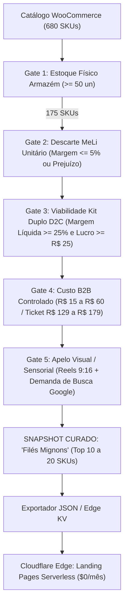

# ADR-0247: Pipeline de Curadoria Algorítmica V8.2 dos "Filés Mignons" (Tier 1 WordPress) para Publicação e Distribuição Serverless no Cloudflare Edge (Tier 2)

**Status:** Aceita  
**Data:** 2026-09-09  
**Autor:** Jeferson Amorim (Founder) & Antigravity Agent  
**Contexto:** CASOSEX & Adsentice OS  
**Dependências & Conexões:** ADR-0016, ADR-0017, ADR-0222, ADR-0240, ADR-0242, ADR-0243, ADR-0244, ADR-0245, ADR-0246  

---

## 1. Contexto & Motivação

Conforme estabelecido na **ADR-0244 (Arquitetura Dual-Tier)**, o ecossistema CASOSEX opera com dois ambientes totalmente segregados:
- **Tier 1 (Privado / Localhost :8085):** WordPress 6.x + WooCommerce + MariaDB + `casosex-mercadolivre-compare` + `wp-adsentice-second-brain`. Responsável pela inteligência contábil, precificação multicanal e governança de estoque de 680 SKUs da fábrica INTT.
- **Tier 2 (Público / Cloudflare Edge $0/mês):** Cloudflare Pages + Workers (V8 Isolate) + Vite + React 19 / Hono + Tailwind CSS v4. Responsável pela entrega ultrarrápida de Landing Pages (TTFB < 20ms, Core Web Vitals 100).

### A Realidade Auditada do Banco de Dados (`medido=verdade`):
Uma auditoria direta na base relacional MariaDB revelou os seguintes fatos mensurados:
1. **680 produtos publicados:** 100% possuem o custo de fábrica B2B (`_casosex_cost_price`) preenchido e auditado.
2. **334 produtos com matching ativo:** Possuem o preço de venda dos concorrentes do Mercado Livre monitorado via `meli_market_price`.
3. **175 produtos com estoque físico real:** Disponíveis imediatamente no armazém do Espírito Santo, somando milhares de unidades prontas para envio.

### O Problema Comercial:
A grande maioria dos 680 produtos sofre com a guerra de preços predatória no Mercado Livre quando comercializados de forma unitária (margem negativa ou centavos de lucro). Ao mesmo tempo, expor os 680 SKUs em campanhas de tráfego pago dilui a verba de mídia, confunde o consumidor e drena o capital de giro.

Torna-se imperativo criar um **mecanismo algorítmico de triagem** que filtre os 175 produtos em estoque e selecione cirurgicamente apenas os **"Filés Mignons"** — produtos que preenchem todos os gates de margem, tração e viabilidade operacional da **V8.2**.

---

## 2. Decisão Arquitetural: O Filtro Algorítmico do "Filé Mignon" (V8.2)

Fica estabelecido o conjunto de **5 Gates Eliminatórios** que um SKU do WooCommerce (Tier 1) deve cumprir para ser promovido a "Filé Mignon" e exportado para o Cloudflare Edge (Tier 2):



### 2.1. Os 5 Gates de Seleção

1. **Gate 1 — Estoque Físico de Segurança ($Q_{\text{estoque}} \ge 50$ unidades):**
   - Elimina o risco de ruptura de estoque no meio de uma campanha de tráfego pago.
   - Garante capacidade de absorver pelo menos 25 vendas de Kit Duplo (50 unidades) sem depender de reposição emergencial da fábrica.
2. **Gate 2 — Canibalização / Descarte no Mercado Livre ($\text{Margem MeLi Unitário} \le 5\%$):**
   - O produto deve sofrer concorrência agressiva de atravessadores no Mercado Livre, tornando a venda unitária desvantajosa e justificando canalizar 100% da distribuição para o canal próprio (D2C).
3. **Gate 3 — Margem Soberana no Kit Duplo D2C ($\text{Margem Líquida Limpa} \ge 25\%$ e $\text{Lucro} \ge \text{R\$ 25,00}$):**
   - O bundle de 2 unidades (ou 3 unidades) deve gerar margem bruta suficiente para absorver frete grátis, taxas de checkout e CPA de mídia paga de até R$ 20,00 sem comprometer o lucro líquido.
4. **Gate 4 — Custo Unitário B2B Acessível ($\text{R\$ 15,00} \le C_{\text{unit}} \le \text{R\$ 60,00}$):**
   - Garante que o Kit Duplo possa ser precificado na faixa psicológica de ouro do e-commerce brasileiro: **R$ 129,90 a R$ 179,90**, com frete grátis percebido como alta vantagem.
5. **Gate 5 — Apelo Sensorial e Compliance de Anúncios:**
   - O produto deve possuir ganchos visuais e sensoriais claros (ex.: vibração líquida, efeito térmico, aromas de frutas, texturas comestíveis) que permitam a criação de roteiros UGC (Reels/TikTok) compatíveis com a política de anúncios e notificados como Grau 1 na ANVISA.

---

## 3. Os Primeiros Candidatos a "Filés Mignons" Auditados

Com base nos dados extraídos diretamente do banco MariaDB em 09/09/2026, os seguintes produtos destacam-se como líderes naturais do ranking:

| ID WC | Produto | Estoque Real | Custo B2B | Preço MeLi | Tese do "Filé Mignon" |
| :---: | :--- | :---: | :---: | :---: | :--- |
| **#3348** | **Pico Lub Uva Verde** | **433 un** | R$ 31,40 | R$ 67,12 | Lubrificante sensorial premium; enorme estoque; base para cross-sell. |
| **#3344** | **Pico Lub Chiclete Menta** | **422 un** | R$ 31,40 | R$ 67,12 | Produto de alto giro jovem; apelo de sabor; Kit Combo Multi-sabores. |
| **#3346** | **Pico Lub Melancia** | **413 un** | R$ 31,40 | R$ 67,12 | Fecha o trio da linha "Pico Lub"; viabiliza Kit Trio Degustação a R$ 169,90. |
| **#3060** | **Excitation Chicleteira** | **306 un** | R$ 52,10 | R$ 106,92 | Produto icônico da marca INTT; alto valor percebido; excelente margem. |
| **#3300** | **O Segredo Déborah Secco** | **213 un** | R$ 44,00 | R$ 91,35 | Autoridade de celebridade; forte prova social e busca direta de marca. |
| **#3035** | **Bubble Vibes Lançamento** | **131 un** | R$ 58,40 | R$ 119,04 | Novidade de mercado com efeito efervescente; alto apelo de novidade no TikTok. |
| **#3352** | **Pico Pulse Melancia** | **108 un** | R$ 45,62 | R$ 94,46 | Gêmeo de sabor do carro-chefe Pico Pulse. |
| **#3354** | **Pico Pulse Uva Verde** | **107 un** | R$ 45,62 | R$ 94,46 | **Dossiê Soberano V8.2 Validado**; piloto pioneiro do motor GTM. |

---

## 4. Pipeline Técnico de Exportação e Publicação no Edge

### 4.1. Rotina de Snapshot (Tier 1)
O plugin `wp-adsentice-second-brain` ou script CLI local executará periodicamente:
1. Varredura dos SKUs com `_stock >= 50` e `_casosex_cost_price > 0`.
2. Execução da classe `CasoSex_MeLi_Pricing_Engine::calculate_all_channels()`.
3. Aplicação do filtro V8.2 e ordenação pelo **Lucro Líquido Limpo no Kit D2C**.
4. Geração do artefato canônico:
   `docs/data/files-mignons-catalog.json`

### 4.2. Estrutura do Snapshot JSON Exportado
```json
{
  "generated_at": "2026-09-09T21:50:00Z",
  "doctrine": "medido=verdade",
  "engine_version": "v8.2",
  "total_curated_skus": 10,
  "products": [
    {
      "id": 3354,
      "sku": "INTT-PICO-01",
      "name": "Pico Pulse Uva Verde INTT 15ml",
      "stock_qty": 107,
      "cost_b2b": 45.62,
      "hero_offer": {
        "type": "kit_duplo",
        "units": 2,
        "price": 159.90,
        "net_profit": 31.76,
        "net_margin_pct": 19.86,
        "cpa_target": 14.50,
        "break_even_product_units": 6,
        "break_even_operational_units": 8
      },
      "discard_meli": {
        "unit_price": 69.80,
        "net_profit": -2.07,
        "status": "DISCARD"
      },
      "readiness_score": 93,
      "campaign_ready": false,
      "gate_status": {
        "d2c_checkout": "PASS",
        "tracking_capi": "WAITING_TEST",
        "policy_clearance": "PASS"
      }
    }
  ]
}
```

### 4.3. Consumo no Cloudflare Edge (Tier 2)
1. O repositório da Landing Page pública (Vite + React 19 / Hono) consome este JSON em tempo de build (SSG) ou via Cloudflare KV dinâmico.
2. Cada produto ganha uma rota estática otimizada no Edge:
   `https://usevolupia.com.br/lp/pico-pulse-uva-verde/`
3. A página carrega com latência inferior a 20ms, com checkout direto apontando para o gateway transacional, sem nunca expor o servidor WordPress local à internet aberta.

---

## 5. Consequências & Governança

1. **Governança de Mídia e Capital:** A empresa investe tempo de criativo e orçamento de tráfego **apenas** nos produtos que têm matemática à prova de balas e estoque suficiente.
2. **Segurança e Performance Absolutas:** O WordPress local continua privado, blindado contra ataques e dedicado exclusivamente à inteligência financeira. O tráfego de massa dos anúncios bate exclusivamente na borda global da Cloudflare.
3. **Escalabilidade Sem Custos Adicionais:** A arquitetura opera sob custo de infraestrutura zero ($0/mês no plano gratuito de Cloudflare Pages/Workers) para atender a milhares de acessos simultâneos sem lentidão.
