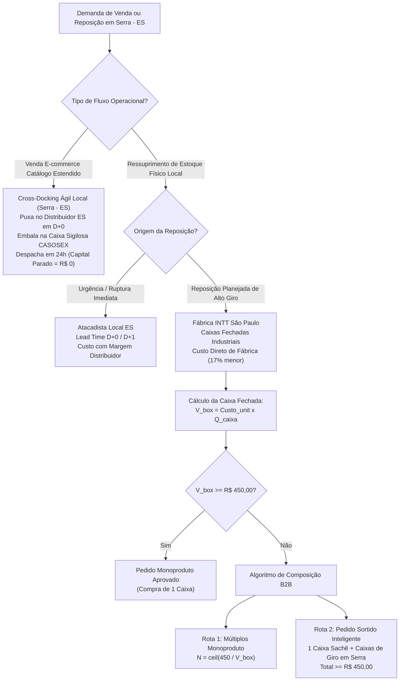

# ADR-0248: Governança de Dual Supply Chain (Fábrica SP vs Armazém Serra ES), Padronização de Caixas Fechadas (`pa_caixa_atacado`), Cross-Docking e Algoritmo de Pedido Mínimo B2B (MOQ R$ 450,00)

**Status:** Aceita  
**Data:** 2026-09-09  
**Autor:** Jeferson Amorim (Founder) & Antigravity Agent  
**Contexto:** CASOSEX & Adsentice OS  
**Dependências & Conexões:** ADR-0240, ADR-0241, ADR-0243, ADR-0244, ADR-0246, ADR-0247  

---

## 1. Contexto & Realidade Medida (`medido=verdade`)

A operação de e-commerce e varejo privativo da CASOSEX (base operacional em Serra - Espírito Santo) depende intrinsecamente da relação comercial com a fabricante e distribuidora de cosméticos sensuais **INTT**.

Auditoria forense executada no banco de dados MariaDB (`casosex-wordpress-db`) em 2026-09-09 revelou uma estrutura dual de fornecimento já estabelecida na taxonomia `dropship_supplier`, porém operando sem uma governança algorítmica formal de abastecimento:

| Origem / Fornecedor | Papel Operacional | SKUs Totais | SKUs c/ Estoque Físico | Saldo em Estoque | Custo Médio B2B | Lead Time Médio |
| :--- | :--- | :---: | :---: | :---: | :---: | :---: |
| **INTT Dropshipping Nacional** (`intt-dropshipping`) | **Fábrica Matriz (São Paulo)** | **469** | 3 | 123 un | **R$ 74,33** | 4 a 7 dias úteis |
| **INTT Espírito Santo** (`intt-es-dropshipping`) | **Distribuidor Local (Armazém Serra - ES)** | **215** | **172** | **6.214 un** | **R$ 89,37** | 0 a 1 dia útil |

### O Problema Identificado:
1. **Ausência de Venda Fracionada na Indústria:**
   A fábrica da INTT em São Paulo **não comercializa unidades avulsas (fracionadas)** para reposição B2B. Todo o catálogo industrial é expedido estritamente em **caixas fechadas / embalagens master** (`pa_caixa_atacado`).
2. **Gargalo Cadastral no WooCommerce:**
   Embora os termos de caixa (`20 un`, `24 un`, `32 un`, `36 un`, `42 un`, `55 un`, `72 un`, `105 un`) existam no banco de dados, apenas **5 produtos** possuíam o atributo associado com `pricing_box_units > 1`. Os demais 470 produtos operavam erroneamente com o default `1 un`, distorcendo cálculos de desembolso inicial de estoque.
3. **Conflito de Pedido Mínimo Industrial ($MOQ = \text{R\$ 450,00}$):**
   Para produtos de baixo valor unitário (ex.: sachês, bisnagas funcionais de 5g a 15g e géis beijáveis com custo B2B entre R$ 3,91 e R$ 8,60), **uma única caixa fechada não atinge os R$ 450,00 mínimos exigidos para faturamento na fábrica**.
   * *Exemplo real:* 1 caixa de 36 sachês a R$ 8,60 = **R$ 309,60** ($< \text{R\$ 450,00}$). Faltam R$ 140,40 para liberar o faturamento.
4. **Necessidade de Liquidez Ágil sem Risco de Capital Parado:**
   Comprar lotes maciços de itens frios consome capital de giro da CASOSEX. É mandatório operar com fluxo de **Cross-Docking** articulando o armazém do distribuidor em Serra - ES e o fluxo consolidado da fábrica em São Paulo.

---

## 2. Decisão Arquitetural

Fica instituída a **Governança de Suprimentos, Compras e Cross-Docking da CASOSEX (Purchase Order & Supply Engine)**:



---

### 2.1. Dual-Tier Supply Governance (Fábrica SP vs Armazém Serra ES)

1. **Tier 1 — Reposição Primária de Alta Rentabilidade (Fábrica São Paulo):**
   - **Objetivo:** Maximizar a margem bruta de contribuição através do custo direto de fábrica (~17% mais baixo em relação ao distribuidor local).
   - **Regras:**
     - Pedido faturado estritamente em **caixas fechadas** (`pa_caixa_atacado`).
     - Valor total do pedido de compra $\ge \mathbf{\text{R\$\ 450,00}}$.
     - Planejamento de compra disparado quando o estoque em Serra atinge o **Ponto de Reposição (ROP)**, considerando o lead time rodoviário de 5 a 7 dias úteis.
2. **Tier 2 — Transbordo & Contingência de Pronta-Entrega (Armazém Serra - ES):**
   - **Objetivo:** Evitar ruptura (stockout) de campanhas de alta conversão (ex.: campanhas Google Ads e PMax ativas nos Filés Mignons).
   - **Regras:**
     - Utilizado como backup imediato (fulfillment em 24h) caso o armazém central sofra pico de demanda súbito enquanto o lote da fábrica de São Paulo está em trânsito rodoviário.

---

### 2.2. Padronização Cadastral de Caixas Fechadas (`pa_caixa_atacado`)

Fica definida a taxonomia estrita e mapeamento compulsório de unidades por caixa fechada para todos os produtos do catálogo:

| Família de Produtos | Quantidade Padrão da Caixa Master (`pa_caixa_atacado`) | Exemplos de SKUs |
| :--- | :---: | :--- |
| **Linha Sachês / Doses Únicas (5g / 8g)** | **36 un** ou **72 un** | Sachês excitantes, bisnagas mono-aplicador |
| **Géis Funcionais / Bisnagas (15g a 17g)** | **42 un** ou **72 un** | Cliv Dessensibilizante, Excitation |
| **Cosméticos Médios (50ml a 100ml)** | **24 un** ou **36 un** | Pomadas, óleos beijáveis, lubrificantes tubulares |
| **Linha Premium / Frascos Grandes (150ml+)** | **20 un** ou **32 un** | Esfoliante Déborah Secco, Hidratantes corporais |
| **Vibradores / Dispositivos Eletrônicos** | **12 un** ou **20 un** | Vibradores líquidos, bullets, estimuladores |

*Mapeamento no Banco:* Cada produto WooCommerce deve possuir o termo correspondente em `pa_caixa_atacado` e a sincronização espelhada em `_pricing_box_units` para alimentar os motores de precificação e o Dossiê Comercial.

---

### 2.3. Algoritmo de Pedido Mínimo B2B (MOQ R$ 450,00 Engine)

Seja:
- $C_{\text{unit}}$: Custo unitário B2B do produto (registrado em `_casosex_cost_price`);
- $Q_{\text{caixa}}$: Quantidade de unidades na caixa fechada (`pa_caixa_atacado`);
- $V_{\text{box}} = C_{\text{unit}} \times Q_{\text{caixa}}$: Custo financeiro de 1 caixa fechada;
- $MOQ = \text{R\$\ 450,00}$: Pedido mínimo de faturamento da fábrica INTT.

#### Caso 1: Caixa Autossuficiente ($V_{\text{box}} \ge MOQ$)
O pedido mínimo é atingido na compra de uma única caixa:
$$\text{Caixas Compradas} = 1$$
$$\text{Investimento Total} = V_{\text{box}}$$
*Exemplo:* Pico Pulse 16g ($36 \times \text{R\$ 43,34} = \text{R\$ 1.560,24}$). 1 caixa fecha o pedido com folga de R$ 1.110,24.

#### Caso 2: Caixa Sub-MOQ ($V_{\text{box}} < MOQ$)
Uma única caixa não atinge o faturamento mínimo da fábrica. O motor oferece duas rotas matemáticas de decisão:

* **Rota 1 — Múltiplos Fechados Monoproduto (Single-SKU Multiplier):**
  $$\text{Caixas Necessárias} = \left\lceil \frac{MOQ}{V_{\text{box}}} \right\rceil$$
  $$\text{Investimento Total} = \text{Caixas Necessárias} \times V_{\text{box}}$$
  $$\text{Unidades Totais} = \text{Caixas Necessárias} \times Q_{\text{caixa}}$$
  *Exemplo (Sachê de R$ 8,60 com 36 un = R$ 309,60):*
  $$\text{Caixas} = \left\lceil \frac{450,00}{309,60} \right\rceil = 2 \text{ caixas} \implies 72 \text{ un} = \mathbf{\text{R\$\ 619,20}}$$

* **Rota 2 — Cesta Sortida de Reposição Inteligente (Assorted Smart Replenishment):**
  Quando a demanda prevista do SKU não justifica duplicar o estoque imediato, o algoritmo de compras compõe uma **Cesta de Caixas Fechadas Sortidas**, selecionando SKUs complementares do armazém de Serra - ES que estejam com maior giro ou menor cobertura de estoque:
  $$\sum_{i=1}^{k} \left( N_i \times V_{\text{box}, i} \right) \ge \text{R\$\ 450,00} \quad \text{onde } N_i \in \mathbb{N}^+ \text{ e cada } N_i \text{ é uma caixa fechada}$$
  *Exemplo:*
  - $1 \times \text{Caixa Sachê 36 un} = \text{R\$ 309,60}$
  - $1 \times \text{Caixa Gel Lubrificante 20 un (R\$ 10,00/un)} = \text{R\$ 200,00}$
  - **Total do Pedido:** $\text{R\$ 309,60} + \text{R\$ 200,00} = \mathbf{\text{R\$\ 509,60} \ge \text{R\$\ 450,00}}$
  - *Resultado Operacional:* Faturamento aprovado na fábrica, zero fracionamento e giro otimizado do armazém em Serra.

---

## 3. Modelo Operacional de Cross-Docking e Valores Estimativos de Reposição (Hub Serra - ES)

### 3.1. Arquitetura Operacional de Cross-Docking Híbrido

O hub da CASOSEX localizado em Serra - ES atua sob uma dinâmica híbrida de **Estoque Buffer para Filés Mignons + Cross-Docking Ágil para Catálogo Amplo**:

```
[ Cliente Final E-commerce CASOSEX ]
               ▲
               │ Despacho Sigiloso em 24h (Correios / Melhor Envio / Transportadora)
               │
   ┌───────────┴──────────────────────────────┐
   │     HUB CASOSEX (Serra - ES)             │
   │  Triagem · Embalagem Sigilosa · Despacho │
   └───────────┬──────────────────────────────┘
               ▲
      ┌────────┴──────────────────────────┐
      │                                   │
[ Rota A: Cross-Docking Local ]    [ Rota B: Cross-Docking Consolidado SP ]
INTT Distribuidor ES (Serra)       INTT Fábrica (São Paulo)
- Coleta/Entrega em D+0 / D+1      - Lotes de Caixas Fechadas
- Catálogo amplo sob demanda       - Chegada D+5 em Serra
- Capital imobilizado = R$ 0,00    - Separação imediata para envio
```

1. **Modalidade 1 — Cross-Docking Local Ágil (Intra-ES, D+0 / D+1):**
   - **Mecânica:** O cliente realiza o pedido na loja virtual para um produto do catálogo estendido (SKUs de cauda longa que não possuem estoque físico permanente na prateleira da CASOSEX).
   - **Fluxo:** O sistema gera a ordem de coleta junto ao parceiro distribuidor INTT em Serra - ES. O produto é transferido para o hub da CASOSEX no mesmo dia (ou D+1), conferido, empacotado na caixa sigilosa padrão CASOSEX (com fita timbrada, papel seda e folheto) e expedido ao cliente final.
   - **Vantagem Financeira:** **Capital imobilizado = R$ 0,00**, risco zero de obsolescência de estoque e entrega ágil para o cliente.
2. **Modalidade 2 — Cross-Docking Consolidado de Fábrica (Inter-SP/ES, D+4 a D+7):**
   - **Mecânica:** Pedidos programados ou campanhas com prazo de entrega estendido no checkout (ex: "Envio Especial de Fábrica: 5 a 8 dias úteis").
   - **Fluxo:** Caixas master consolidadas chegam ao hub de Serra via transportadora fracionada rodoviária. Na bancada de recepção, as unidades já vendidas são faturadas, bipadas e despachadas imediatamente para a transportadora final sem sequer serem armazenadas em prateleira. O excedente da caixa master abastece o buffer local de pronta-entrega.

---

### 3.2. Valores Estimativos de Investimento por Ciclo de Reposição

Com base na estrutura de custos auditada no banco de dados e nos volumes de caixas industriais da INTT, os ciclos de compras para reposição no armazém de Serra - ES são categorizados em quatro faixas orçamentárias:

| Nível de Ciclo de Reposição | Faixa de Investimento Estimativo | Composição Típica do Pedido | Frequência Típica | Objetivo Estratégico |
| :--- | :---: | :--- | :---: | :--- |
| **Nível 1: Pedido Mínimo / Teste de Tração** | **R$ 450,00 a R$ 900,00** | 1 caixa autossuficiente ou 1 a 2 caixas sortidas (ex: 36 sachês + 20 géis) | Semanal / Pontual | Validação de novos SKUs ou reabastecimento pontual de itens em teste. |
| **Nível 2: Lote Padrão de Filés Mignons (Recomendado)** | **R$ 1.500,00 a R$ 3.500,00** | 2 a 3 caixas fechadas master (ex: 1 cx Pico Pulse 36 un R$ 1.560 + 1 cx Excitation 42 un R$ 1.200) | Quinzenal | Sustentação de campanhas ativas de tráfego pago (Google Ads / PMax) sem risco de ruptura. |
| **Nível 3: Abastecimento Mensal Consolidado** | **R$ 4.500,00 a R$ 7.500,00** | 4 a 6 caixas fechadas variadas cobrindo os 5 top sellers + reposição de lubrificantes e beijáveis | Mensal | Diluição drástica do frete interestadual SP $\to$ ES (< 2,5% do valor da carga) e ganho de margem máxima. |
| **Nível 4: Lote Sazonal / Black Friday / Escala** | **R$ 10.000,00 a R$ 18.000,00** | Grade completa de caixas master com negociação direta de bonificação/condição comercial | Trimestral / Sazonal | Garantir volume para picos sazonais com poder de fogo comercial. |

---

### 3.3. Impacto do Frete Interestadual no Custo Efetivo

O frete rodoviário interestadual (São Paulo $\to$ Serra - ES) possui uma taxa mínima fracionada (coleta + redespacho) tipicamente entre **R$ 70,00 e R$ 130,00** para volumes de até 20kg a 40kg:
- **No Pedido Mínimo de R$ 450,00:** O frete de R$ 90,00 representaria **20,0% do valor da compra**, encarecendo severamente o custo unitário do produto.
- **No Lote Padrão de R$ 2.500,00:** O frete de ~R$ 110,00 representa apenas **4,4% do valor da compra**.
- **No Lote Consolidado de R$ 5.000,00:** O frete representa **menos de 2,5%**, preservando a integridade da margem de contribuição líquida calculada na [ADR-0246](file:///media/jeffer/5aab5a95-8290-d3f7-2e4f-8c27cc2d09a93/CASOSEX/docs/adr/0246-casosex-rigorous-break-even-contribution-margin-and-b2b-moq-lot-mechanics.md).

---

## 4. Impacto no Dossiê Comercial e no Motor de Precificação

1. **Camada de Supply no Dossiê (V8.2+):**
   - O card de viabilidade de lote deve exibir explicitamente:
     * *Unidades por Caixa Fechada:* $Q_{\text{caixa}}$
     * *Custo da Caixa:* $V_{\text{box}}$
     * *Status MOQ Fábrica:* `APROVADO (1 Caixa)` ou `SUB-MOQ (Exige R$ X adicionais ou N Caixas)`
     * *Opção Recomendada:* Compra sortida vs Múltiplo monoproduto vs Cross-Docking Local.
     * *Modalidade Logística Indicada:* Cross-Docking Local ES (D+0) ou Reposição Fabril SP (D+5).
2. **Reconciliação com Break-Even Financeiro (ADR-0246):**
   - O Ponto de Equilíbrio em unidades ($BreakEven$) passa a considerar o lote efetivamente faturado (seja de 1 caixa, $N$ caixas monoproduto ou cota rateada da cesta sortida), evitando ilusão de liquidez.

---

## 5. Governança e Próximos Passos de Execução

1. **Rotina de Enriquecimento de Catálogo:**
   Desenvolver script determinístico para preencher em lote as unidades por caixa (`pricing_box_units` e `pa_caixa_atacado`) baseado no histórico de compras da INTT e especificações técnicas de embalagem da indústria.
2. **Atualização do Matcher e Simulador:**
   Ajustar [`CasoSex_MeLi_Pricing_Engine`](file:///media/jeffer/5aab5a95-8290-d3f7-2e4f-8c27cc2d09a93/CASOSEX/wp/plugins/casosex-mercadolivre-compare/inc/class-meli-pricing-engine.php) e [`class-commercial-dossier.php`](file:///media/jeffer/5aab5a95-8290-d3f7-2e4f-8c27cc2d09a93/CASOSEX/wp/plugins/casosex-mercadolivre-compare/inc/class-commercial-dossier.php) para exibir os dados de Pedido Mínimo, Reposição Sortida e Rota Logística (Estoque vs Cross-Docking).
