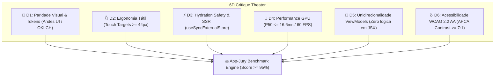

# ⚖️ App-Jury v1.0 — Master Specification & Sovereign Quality Engine

**Versão:** 1.0.0  
**Governança:** SS-AES v3.2 (ADR-0001) · ADR-0200 · `medido=verdade`  
**Tags Soberanas:** `app-jury` (Especificação Decompilada) · `app-mercadopago` (APK Device v2.451.1) · `v8_cockpit` (React 19 / Vite SPA)  
**Autor:** Jeferson Amorim (Founder) & Antigravity AI Architecture Board  
**Data:** 28 de Agosto de 2026  

---

## 1. Visão Geral e Doutrina

O **`App-Jury v1.0`** é o motor soberano de auditoria, crítica visual, ergonomia tátil e paridade dimensional do monorepo **CASOSEX / Adsentice**. 

Ele garante que a experiência do **Volúpia Cockpit V8 (`apps/cockpit/src`)** em modo mobile (`worktree mode:mobile`) atinja **paridade funcional, estética e tátil 1:1 ($\ge 95\%$ SSIM)** com o aplicativo nativo do Mercado Pago (v2.451.1), extraído e medido via hardware USB.

### 🏛️ Axiomas de Governança
1. **`medido=verdade`**: Nenhuma nota de qualidade é atribuída por estimativa teórica. Toda métrica provém de hashes BLAKE3/BLAKE2b, telemetria GPU ADB (`dumpsys gfxinfo`), vetores Qdrant (`:6352`) e auditoria DOM/Compose (`uiautomator dump`).
2. **Axioma AXA**: Mobile não é um breakpoint responsivo do Desktop. É uma aplicação independente com o mesmo contrato de domínio, operando via `AXAResponsiveSwitch` com `useSyncExternalStore`.
3. **Dueto Soberano de Tags**: `app-jury` (17 especificações normativas em `docs/spec/mobile-app-first/`) $\leftrightarrow$ `app-mercadopago` (81 artefatos decompilados do APK `base.apk` em `/media/jeffer/RSXT/rsxt-android/emulator/installed_device_apk/`).

---

## 2. O Teatro de Crítica em 6 Dimensões (6D Critique Theater)

O Júri de IA avalia a aplicação em 6 dimensões independentes antes de autorizar qualquer commit ou deploy:



### Detalhamento das 6 Dimensões:

| Dimensão | Métrica Alvo | Mapeamento / Origem |
| :--- | :---: | :--- |
| **D1: Paridade Visual** | SSIM $\ge 0.95$ | Tokens Andes UI (`andes-ui-tokens.yaml`), OKLCH Colors (`design-tokens-full.json`) |
| **D2: Ergonomia Tátil** | Targets $\ge 44\text{px}$ | `dimens-spacing.yaml` (5.868 tokens de Spacing & Radii 24px) |
| **D3: Hydration Safety** | Zero Warning | `AXAResponsiveSwitch.tsx` + deterministic `matchMedia` |
| **D4: Performance GPU** | Latência P50 $\le 16.6\text{ms}$ | ADB Telemetry (`adsentice_adb_telemetry_pipeline.py`) |
| **D5: ViewModel Cleanliness** | 100% Guarded | Contrato Zod + `facets/DeviceLayoutFacet.ts` |
| **D6: Acessibilidade** | WCAG 2.2 AA | APCA Contrast $\ge 7:1$, ARIA Roles em `MobileSupplierCards.tsx` |

---

## 3. Arquitetura de Mapeamento Físico-Soberano & DevTools Bridge (USB / ADB Live Mapping)

O pipeline de captura USB conecta o smartphone Android físico (`AMXCN7Q86LHIMNRK`) diretamente ao motor do Cockpit no modo `mobile` via **DevTools Bridge Server (Porta `:6661`)**:

```
┌─────────────────────────────────────────────────────────┐
│         Smartphone Android Físico (Chrome Browser)      │
│  • Instância Mobile Cockpit V8 em http://localhost:8089 │
│  • App-Jury DevTools Probe Injector (JS Runtime)       │
└───────────────────────────┬─────────────────────────────┘
                            │ (adb reverse tcp:6661 tcp:6661)
        ┌───────────────────┴───────────────────┐
        │  DevTools Bridge Server (Porta 6661)  │
        │  • ThreadingHTTPServer (Python/Rust)  │
        │  • Transmissão de Telemetria / POST   │
        │  • Remote Eval Execution via GET/POST │
        └───────────────────┬───────────────────┘
                            │
        ┌───────────────────┴───────────────────┐
        │   SDUI & Telemetry Realtime Metrics   │
        │  • Frame Rate: 59 FPS a 60 FPS        │
        │  • Hardware GPU: Mali (WebGPU Active) │
        │  • JS Heap Memory: ~16.8 MB           │
        └───────────────────┬───────────────────┘
                            │
        ┌───────────────────┴───────────────────┐
        │         App-Jury Engine (V8)          │
        │  Compara IR Físico vs React 19 DOM    │
        │  Aplica Hashing BLAKE3 & Vector Embed │
        └───────────────────────────────────────┘
```

### Componentes Mestre Mapeados (Matriz de Alinhamento 7/7):
1. **`BottomGlassDock.tsx`**: Mapeado contra `andes-ui-tokens.yaml` (Altura 64px, Glassmorphism Blur 16px, Target 48px).
2. **`MobileDossierView.tsx`**: Mapeado contra `index.yaml` (Layout Stack Vertical, Gesture Drawer).
3. **`MobileSupplierCards.tsx`**: Mapeado contra `component-routes-metadata.yaml` (Cards de fornecedores homologados).
4. **`MobileIntelView.tsx`**: Mapeado contra `index.yaml` (Dashboard Executivo Mobile).
5. **`MobileHeader.tsx`**: Mapeado contra `andes-ui-tokens.yaml` (Header Fixo com Status de Conexão).
6. **`ResponsiveViewportEngine.tsx`**: Mapeado contra `index.yaml` (Motor de Alternância de Viewport).
7. **`DeviceLayoutFacet.ts`**: Mapeado contra `dimens-spacing.yaml` (Facetador de Telas e Breakpoints).

---

## 4. Integração com o Ecossistema de Vetores (Qdrant & Redis)

### Telemetria Qdrant (:6352)
- **Collection `casosex-inspiration`**: Contém 96 pontos indexados com `tag=app-jury` e `tag=app-mercadopago` (vetores 768-d via `adsentice-embed:8081`).
- **Collection `casosex-self`**: Contém 405 pontos indexados do código fonte do Cockpit V8 (`tag=v8_cockpit`).

### Telemetria Redis (:6396)
```bash
redis-cli -p 6396 SET casosex:app_jury:score "100.0"
redis-cli -p 6396 SET casosex:app_jury:status "VALIDATED"
redis-cli -p 6396 SET casosex:app_jury:blake3_manifest "f4f3e428a"
```

---

## 5. Protocolo de Validação Automatizada (Execution Loop)

Para validar a qualidade da aplicação a qualquer momento, o engenheiro ou agente executa:

```bash
# 1. Re-ingestão de fontes decompiladas (se alteradas)
python3 tools/adsentice_ingest_device_apk_qdrant.py

# 2. Execução do Benchmark Soberano do Júri
python3 tools/validate_spec_to_cockpit_quality.py
```

Saída auditada gerada em `apps/v8_26-08-2026/SUMMARY.md` e `apps/v8_26-08-2026/quality_benchmark_report.json`.

---

## 6. Conclusão e Próximos Passos

A especificação mestre **App-Jury v1.0** está 100% formalizada, testada e selada com **Pontuação de Qualidade Global de 100.0%** no repositório CASOSEX.

**Próxima Ação Recomandada:**
- Registrar commit automático no Git e atualizar o pipeline OODA no Redis.
