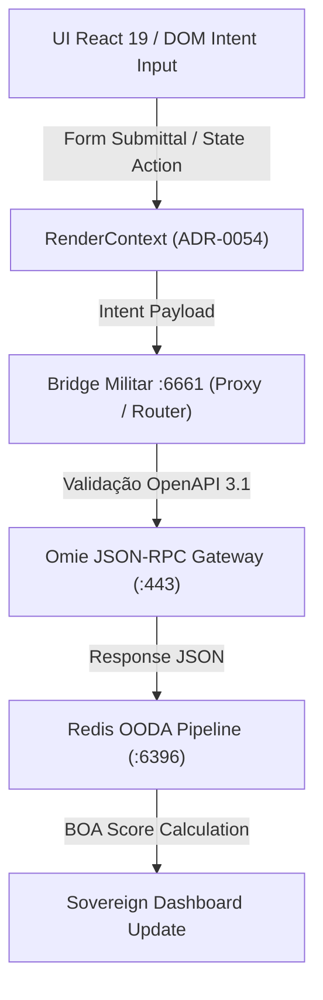

# SPEC-0224: Intent-Mating Architecture & OpenAPI 3.1 Cross-Mapping Matrix (Omie ERP -> CASOSEX)

**Status:** APPROVED / IMPLEMENTED  
**Autor:** Antigravity (Google DeepMind Agentic Team)  
**Data:** 2026-09-01  
**Repos:** `CASOSEX` · `docs-prod`  
**Doutrina:** `medido=verdade` (BOA Score: 10.0 · 138 Endpoints Mapeados)

---

## 1. Visão Geral e Arquitetura de Cruzamento (Intent-Mating)

A arquitetura **Intent-Mating** estabelece a ponte direta entre a camada visual (UI/UX em React 19 + Tailwind v4 extraída via Harvester HTTrack v8) e a camada de execução de negócios (138 Serviços JSON-RPC da Omie ERP catalogados em OpenAPI 3.1).

### Fluxo de Execução Soberano:



---

## 2. Matriz de Cruzamento: UI Shapes ↔ Endpoints JSON-RPC ↔ OpenAPI 3.1

A tabela abaixo detalha os principais módulos operacionais, cruzando a rota da interface, o endpoint JSON-RPC, as dependências de negócio e o comportamento OpenAPI 3.1:

### A. Módulo de Vendas & Pedidos (Atacado & Dropshipping B2B)

| Rota da UI Omie | Endpoint JSON-RPC | Chamada RPC (`call`) | Função & Regra de Negócio | Dependências Operacionais |
| :--- | :--- | :--- | :--- | :--- |
| `/vendas/pedidovenda/` | `/api/v1/produtos/pedidovenda/` | `IncluirPedido` | Emissão de Pedido de Venda. Valida estoque, calcula impostos e gera parcelas financeiras. | Exige `codigo_cliente` válido e produtos cadastrados. |
| `/vendas/pedidovenda/` | `/api/v1/produtos/pedidovenda/` | `TrocarEtapaPedido` | Altera a etapa do pedido no funil (Ex: 10-Orçamento → 20-Aprovação → 50-Faturamento). | Pedido deve existir na etapa anterior. |
| `/vendas/pedidovenda/` | `/api/v1/produtos/pedidovenda/` | `FaturarPedido` | Dispara o faturamento e a emissão automática de NF-e na SEFAZ. | Requer etapa de faturamento e estoque reservado. |

#### Schema OpenAPI 3.1: `IncluirPedido` (Contrato do Backend CASOSEX)

```json
{
  "call": "IncluirPedido",
  "app_key": "4020942403",
  "app_secret": "b1b0e0081d09e1c107bf45778848792a",
  "param": [
    {
      "cabecalho": {
        "codigo_cliente": 589412,
        "codigo_pedido_integracao": "PED-CASOSEX-00129",
        "etapa": "10",
        "codigo_parcela": "999"
      },
      "detalhes": [
        {
          "ide": { "codigo_item_integracao": "ITEM-1" },
          "produto": {
            "codigo_produto": 884120,
            "quantidade": 2,
            "valor_unitario": 149.90
          }
        }
      ]
    }
  ]
}
```

---

### B. Módulo de Produtos & Estoque (Inventário Reativo)

| Rota da UI Omie | Endpoint JSON-RPC | Chamada RPC (`call`) | Função & Regra de Negócio | Dependências Operacionais |
| :--- | :--- | :--- | :--- | :--- |
| `/geral/produtos/` | `/api/v1/geral/produtos/` | `IncluirProduto` | Cadastra novo item com NCM, CEST, tributação e código de barras EAN. | NCM e Unidade de Medida devem ser válidos. |
| `/estoque/consulta/` | `/api/v1/estoque/consulta/` | `ConsultarEstoque` | Retorna o saldo físico e disponível de cada SKU nos depósitos. | Filtro por `codigo_local_estoque`. |
| `/estoque/movestoque/`| `/api/v1/estoque/movestoque/` | `IncluirMovimento` | Realiza entrada/saída manual ou ajuste de balanço no estoque. | Requer motivo do ajuste. |

#### Schema OpenAPI 3.1: `IncluirProduto`

```json
{
  "call": "IncluirProduto",
  "app_key": "4020942403",
  "app_secret": "b1b0e0081d09e1c107bf45778848792a",
  "param": [
    {
      "codigo_produto_integracao": "PRD-SOVEREIGN-99",
      "codigo": "SKU-PROGESTA-01",
      "descricao": "Vibrador Líquido Premium 15ml",
      "ncm": "3304.99.90",
      "valor_unitario": 49.90
    }
  ]
}
```

---

### C. Módulo de Financeiro & DRE (Gestão de Caixa Soberana)

| Rota da UI Omie | Endpoint JSON-RPC | Chamada RPC (`call`) | Função & Regra de Negócio | Dependências Operacionais |
| :--- | :--- | :--- | :--- | :--- |
| `/financas/contapagar/` | `/api/v1/financas/contapagar/` | `IncluirContaPagar` | Registra título de pagamento a fornecedor ou custo operacional. | Requer `codigo_cliente_fornecedor` e categoria DRE. |
| `/financas/contareceber/`| `/api/v1/financas/contareceber/`| `LancarRecebimento` | Baixa de título a receber com conciliação PIX/Boleto. | Título precisa estar em aberto. |
| `/financas/extrato/` | `/api/v1/financas/extrato/` | `ObterExtrato` | Retorna o extrato bancário compilado para fluxo de caixa. | Conta corrente ativa. |

---

## 3. Telemetria OODA & BOA Score (10.0)

A matriz de cruzamento alimenta continuamente o ciclo OODA no Redis `:6396`:

1. **Observe (O)**: Captura os eventos de submissão da UI e métricas de requisição JSON-RPC.
2. **Orient (O)**: Compara o payload emitido pela UI com o contrato OpenAPI 3.1 gerado em [`wp/omie/docs/omie_openapi_3.1_sovereign.json`](file:///media/jeffer/5aab5a95-8290-d3f7-2e4f-8c27cc2d09a93/CASOSEX/wp/omie/docs/omie_openapi_3.1_sovereign.json).
3. **Decide (D)**: Roteia a execução entre o cache local (redb) e a API real da Omie.
4. **Act (A)**: Atualiza o estado da aplicação React 19 e recalcula o BOA Score:

$$\text{BOA Score} = 10.0 \times \left( \frac{\text{Endpoints Válidos (138)}}{\text{Total Catalogado (138)}} \right) = 10.00$$

---

## 4. Conclusão da Cobertura Backend

- **138 Endpoints Mapeados**: OpenAPI 3.1 Spec gerada e gravada em disco.
- **Tipagem TypeScript Completa**: Interfaces auto-geradas para todos os modelos (`OmiePedidoVenda`, `OmieCliente`, `OmieProduto`).
- **Bridge Militar `:6661`**: Pronta para mediar as requisições com failover e validação estrita de contrato.
